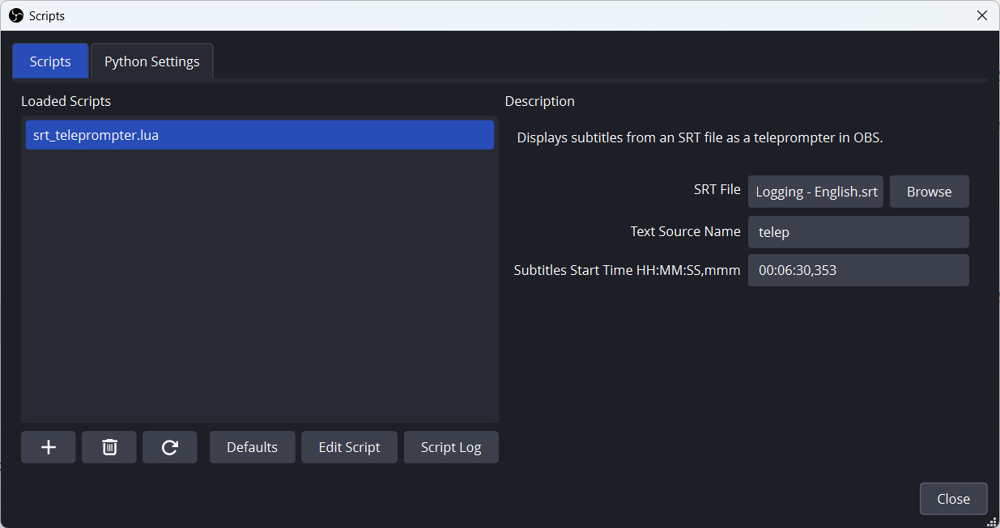
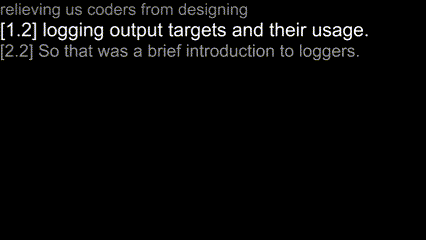

# OBS-Teleprompter
A *time* sensitive teleprompter script for OBS Studio 31

OBS Teleprompter consists of a single OBS Studio LUA script (Tested on 31.0.1).
The script needs to be added in OBS Studio under the menu tools/scripts.
Add the script and set the parameters:
+ SRT File: An SRT subtitles file with timings. This is the file used to time the teleprompting.
+ Text Source Name: base name of the text source that will be used to display the changing subtitle text.
  Prev/Next sources are supported by adding the prefix "prev " / "next " to this base name, respectively.
+ Subtitles Start Time HH:MM:SS,mmm: An *optional* start time for the first subtitle to use. Must be empty or in the exact right format (so don't forget the millisecs).
  This is the same format as used in the SRT file so simly copy-paste.

In OBS Studio, add Text sources (GDI+ on windows):
+ A text source named the same as the name you put in the above "Text Source Name" field. I use "telep". This is used to display the text of the current subtitle/prompt.
+ A text source named the same as the name you put in the above "Text Source Name" field, prefixed with "prev ". I use "prev telep". This is used to display the text of the previous subtitle/prompt.
+ A text source named the same as the name you put in the above "Text Source Name" field, prefixed with "next ". I use "next telep". This is used to display the text of the next subtitle/prompt.

Arrange the text sources location and color as you like. I put the prev prompt on top, followed by the current prompt, followed by the next prompt. I also arrange the colors to emphasize the current prompt.

Once you start recording a 3 sec delay is added to the prompting to give you time to arrange your self. You can change that in the code.

See attached video for demo.

